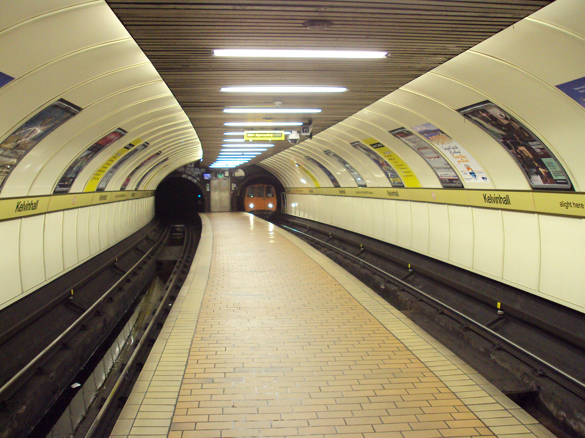

Due to the fact that you have not yet grduated from High School, the company refuses to hire you. It is difficult for you to find a job. You ended up using all the money that you have and become a beggar in the subway station.
  
Credits to [Wikimedia Commons](https://commons.wikimedia.org/wiki/File:Kelvinhall_subway_station,_Glasgow_-_DSC06276.JPG)  

[Start Over](../kicked-out.md)